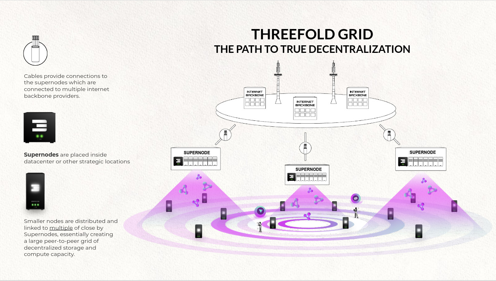

## Existing decentralization projects

There are a number of project operational that are creating decentralised utility for data processing and storage. ThreeFold is a multidisciplinary project which touches all of the bases for creating a new IT stack fueling the Internet.

To the extent that it provides a complete suite for hosting a decentralized protocols' computation, storage, and network requirements, ThreeFold technology is a logical foundation for any forward looking decentralization initiative.

## ThreeFold Decentralized (autonomous) compute and storage 

ThreeFold is a project the seeks true decentralization for traditional IT capacity generation. They are creating a foundational layer for the internet, cloud and layer-1 blockchain protocols.

We might not realise everyday but the internet is in the hands of a handful of large organizations that make the internet work as it works today in a very centralized way. There are two camps:
- network providers: mostly the Tier 1 players that have been working together since the inception of the internet to guide and direct traffic and have been providing interconnect services for lower tiers, national and regional players to the rest of the world.
- datacenter (or a more modern version of them, cloud) providers.  Datacenters are the end point for all the networks  Datacenters are (literally) massive warehouses that house servers on which (most, if not all today) of the internet content and services are processed and stored.  This includes today public services, private services, freemium services bot also mostly all of the blockchain projects rely on massive cloud providers providing them with data processing and storage services.

So this internet is governed my a small number of network providers that *decide* how internet traffic flows are and who gets to pay for transit services and who not (internet transit between two parties where no money exchanges hands is called peering) and a small number of datacenter that control all the content on the internet, get freemium information about consumer behavior and know everything about us.

ThreeFold is pushing a technology stack into the world where the people are back in the capacity (data processing and storage) production role and also provide this produced capacity to consumers of capacity that have access to efficient, sustainable, decentralized and affordable capacity without being caught in a walled garden of a large centralized provider.

Find more information here:
- website: http://www.threefold.io
- library: http://library.threefold.me

#### What does ThreeFold bring

ThreeFold brings a technology stack that undoes a lot of the (unnecessary) complexity that currently exits in the world of Internet and more generic the world of Information Technology.  This technology stack includes:
- an autonomous, secure, lightweight and efficient operating system that enables anyone to create data processing and storage capabilities everywhere where electricity meets connectivity.
- the use of (any) blockchain to do value transactions and smart contracts for operational IT workloads descriptions.  Today they use the Stellar Network and Polkadot substrate as the main two blockchains. Their strategy is to become a multichain platform and provide decentralized smart contracting capabilities for IT architectures that can run any IT workload currently supported on market leading clouds but then 100% decentralized. The most well known cloud interfaces to orchestrate a cloud infrastructure are supported (Kubernetes, Docker, terraform, typescript etc.)

In order reach their goal ThreeFold has developed a large number of building blocks that can be molded into an architecture that can achieve blockchain pruning functions without much (if at all) impact to the blockchain operations.
