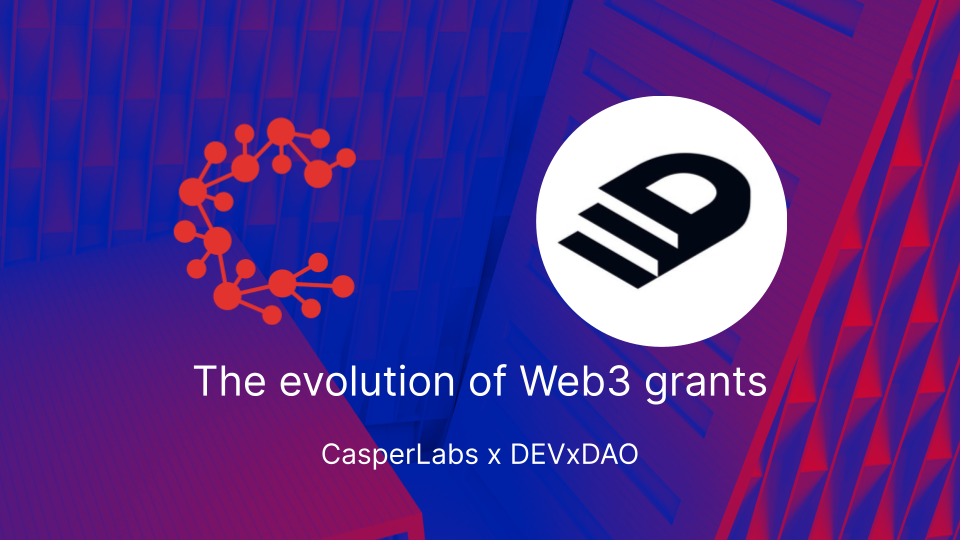

  

# Grant

- Received Grant Before: No
- Grant amount total; 500k
- Grant Id: 36
- Completion: 100%
- User Id: 168 (maybe this should be relocated)
- Company or Organization: ThreeFold

## Benefits

The current internet mainly consists of centralized datacenters and networks owned and operated by a handful of service providers.  80% of the Internet belongs to less than 10 companies.  This is not helping blockchain layer-1 projects to achieve reliability and decentralization.

In this internet, blockchain node (owners) have two options:
- go to one of the market leader in cloud solution, get a VM and work their way through the install protocol for the blockchain node.
- get a (dedicated) server (hosting provider, colo or in a home or business setting) and use that bare metal, choose an OS and then follow the install protocol for the blockchain node.

Both require a fair amount of technical knowledge and require commitment and care throughout the timetime / cycle of the blockchain node operations.  This current situation has two major drawbacks:
- relying on centralized hosting providers builds a very centralized blockchain node group deployment on those massive cloud providers.  Decentralization is not achieved and there is a fair amount of risk involved when issues occur in these datacenters.
- having to choose between cloud or bare metal and then following the installation protocol for the specific blockchain deployment requires a fair amount of technical skills.  This is not for everyone. 

## Solving the problem
ThreeFold is creating technology that creates a decentralized grid with compute and storage capabilities to build a new internet that is not in the hands of a few monopolies but in the hands of many. This stack is centered around a solid "layer-0" which works in a very different way than traditional clouds.

We will identify that this technology is well positioned to create a decentralized platform with smart contract deployment methods that can automate 99% of the work needed for blockchain node deployments.  This overcomes the 2 problems identified with the current solutions:
- this ThreeFold grid, an internet of internets, is owned by many individuals, companies and governments and presents a true decentralized platform to run blockchain nodes.
- the knowledge required to do such a deployment does not surpass knowledge needed to maintain a digital currency wallet.  And even that can be avoided.

This technology based will be used to create a distributed and decentralized cloud platform where blockchain nodes can run from home, school, office and datacenter locations.  A true step forward in make blockchains resilient.

## Our Team has massive experience in storage & internet technology

- first data deduplication system in the world for datacenters & backup (acquired by veritas/symantec) (2002)
- first always consistent distributed key value database in the world https://dbdb.io/db/arakoon (2010-2015)
- first proof of blockstake blockchains in the world (was called Rivine, discontinued because of lack of funds)
- first distributed storage system based on forward looking correcting codes (see Amplidata, used by major governments), scales to zetabytes
- probably first and super high performance always consistent disk volume driver on top of Arakoon and Amplidata, we were able to demonstrate 10.000.000 IOPS in 1 rack back in 2013
- first distributed block based storage system on top of Infiniband for ZFS (was done just before we were acquired by SUN microsystems)
- major world records in relation to hosting of very big internet sites (1998-2000) with global loadbalancing and caching at a time this was not done yet

> We are delighted to use this expertise for the benefit of the world and are grateful for the chance devxdao gives us to develop and contribute even more.

## Milestone 1 (100% done) = 250k USD

- Milestone title:  Create the ability to run layer-1 blockchain nodes on the ThreeFold Technology grid.
- 
- The portion that the OP is requesting from the total grant for the milestone: 
    - USD 250.000 (was $100k originally)
- Due date: 
    - done
- Details of what will be delivered:
    - prove Layer-1 blockchain provisioning can be done (this is a massive achievement and has incredible benefits for the industry)
    - Initial research will be done with the Casper Labs Layer-1 protocol and also some other blockchains.
    - Create the solution which allows everyone to verify provisioning can be done.

> remarks: we were an early grant and were trying to get feedback before submitting because there was no clarity for us how to do it and how sure we would be on the grant. We might have been not good enough in our communication, but the grant got removed before we could receive funding for the work done. We hope that this might be recovered, as such we have updated this document to reflect our current situation and work done.

### Acceptance Criteria:

> we hope that the reader can see how this work has an incredible potential for the blockchain industry. We have been able to show how blockchains can be deployed on a decentralized grid and helps to achieve reliability, security, privacy and scalability.

- [X] provisioning solution can deploy blockchain nodes and this can be done by everyone
- [X] see how the provisioning method (1-click) cuts heavily on complexity
- [X] deploy a large blockchain in less than 5mins which would have taken hours before (software deployment)
- [X] all required code to allow everyone to experiment (see weblets repository [here](https://github.com/threefoldtech/grid_weblets))
- [ ] agree which blockchain node type
- [X] all code is opensource (threefold as well as the deployers for provisioning)
- [X] do detailed research about casperlabs to see how integration can be done (and if): our conclusion it can be done (and is done)
- [X] link to required technology parts as provided by ThreeFold, see if we can use those solutions and what benefit would be
- [X] do all required work to let it work on ThreeFold Grid

## Milestone 2 (ready to be executed) = 250k USD

Extend the TFGrid with capacity for all current layer-1 protocols involved in ETA

- Milestone title:  Extend the TFGrid with capacity for all current layer-1 protocols involved in ETA
- The portion that the OP is requesting from the total grant for the milestone: 
    - USD 250.000 (was $400k original)
- Due date: 
    - December 2022
- Details of what will be delivered:
    - base on ETA (CasperLabs) input desing capacity size and geographic location and distribution requirement
    - agree with CasperLabs which POC/Operational partners are to be included in this capacity 
    - 
 implement all required components for base system as defined in [solution part of doc](../solution/solution.md)

### Acceptance Criteria:

We have been able to leverage a lot of technology from Threefold Tech which has been developed over the last 10 years. This grant was all about making sure and improving this codebase so it can be used for casperlabs. This is the result of hundreds of manmonths for which we are delighted to receive some recognition in a form of a grant.

- [X] zdb with all required features as required for the prune DB (opensource)
- [X] zdb storage containers
- [X] caching capability if the technology
- [X] FLECC codec implemented and available as golang code (opensource)
- [X] ZDB storage containers caching & encoding with FLECC codec.
- [X] FLEXX encoding & distribution to 20+ backends
- [X] self healing on the data, prove that data cannot be corrupted
- [X] automatic recovery of broken ZDB instances on nodes
- [X] deployment system on top of TFGrid 
- [X] metadata system
- [X] read path is redundant, can come from multiple ZDB backends
- [ ] better description of the solution
- [ ] documentation and make demonstration tutorials in text and video
- [ ] document all links to code & scripts as used on above

{{#include grants_future.md}}

