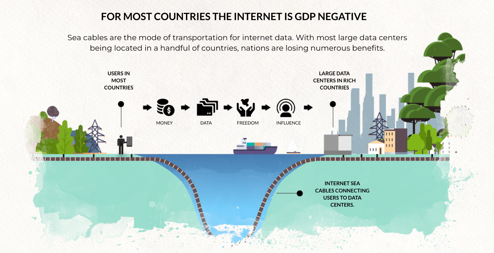

# The problem statement

## Introduction
This research document represents the first milestone in the grant that has been awarded by DEVxDAO. This document will lay out the challenges that need to be overcome to create a lasting generic solution for simple blockchain node deployments.  

## Problem statement

The current internet mainly consists of centralized datacenters and networks owned and operated by a handfull of service providers.  80% of the Internet belongs to less than 10 companies.  This is not helping blockchain layer-1 projects to achieve reliability and decentralization.

In this internet blockchain node (owners) have two options:
- go to one of the market leader in cloud solution, get a VM and work their way through the install protocol for the blockchain node.
- get a (dedicated) server (hosting provider, colo or in a home or business setting) and use that bare metal, choose an OS and then follow the install protocol for the blockchain node.

Both require a fair amount of technical knowledge and require commitment and care throughout the timetime / cycle of the blockchain node operations.  This current situation has two major drawbacks:
- relying on centralized hosting providers builds a very centralized blockchain node group deployment on those massive cloud providers.  Decentralization is not achieved and there is a fair amount of risk involved when issues occur in these datacenters.
- having to choose between cloud or bare metal and then following the installation protocol for the specific blockchain deployment requires a fair amount of technical skills.  This is not for everyone. 

## Solving the problem
ThreeFold is creating technology that creates a decentralized grid with compute and storage capabilities to build a new internet that is not in the hands of a few monopolies but in the hands of many. This stack is centered around a solid "layer-0" which works in a very different way than traditional clouds.

We will identify that this technology is well positioned to create a decentralized platform with smart contract deployment methods that can automate 99% of the work needed for blockchain node deployments.  This overcomes the 2 problems identified with the current solutions:
- this ThreeFold grid, an internet of internets, is owned by many individuals, companies and governments and presents a true decentralized platform to run blockchain nodes.
- the knowledge required to do such a deployment does not surpass knowledge needed to maintain a digital currency wallet.  And even that can be avoided.

This technology based will be used to create a distributed and decentralized cloud platform where blockchain nodes can run from home, school, office and datacenter locations.  A true step forward in make blockchains resilient.

