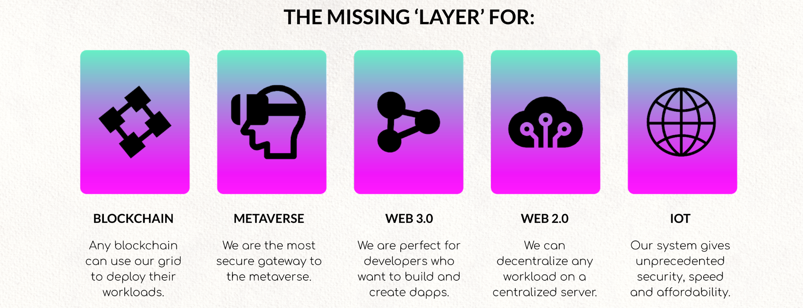

# Solution

To step away from the centralized ownership of servers and networks that make up the internet a different model is needed.  This model needs to incentivize independent server owners to make their servers part of a collective grid that make up a new internet.  An infrastructure layer producing compute and storage capabilities.  Similar to how solar panels create electricity and can form an electricity grid serving a community.

This server owners can house their servers anywhere where there is reliable power and electricity in a house, school, office or government building.

## Solution components

### Capacity creation: Farming
To decentralize ownership of this new internet layer we have to create incentives for people, companies and government bodies to invest in hardware, provide electricity and hardware and start creating compute and storage capacity. This is called farming.  A faming model is developed in which farmers (hardware owners) get a reward for providing this capacity.  The farming model is described in great detail [here](https://library.threefold.me/info/threefold#/tfgrid/farming/threefold__farming_intro)

Farmers create compute and storage units to the size of their hardware units which can be used by application and service providers.  An overview of the current size and state of the grid build by farmers please have a look and the [grid explorer](https://explorerv3.grid.tf/).

### Capacity consumption: Cultivation

All these compute (CU), storage (SU) and network (NU) units create a decentralized cloud. This cloud can  be used to build real world experiences similar (or better than) on the existing centralized clouds.  It enables all current digital innovators to have a decentralized alternative to large central clouds.

### How to use this cloud

Under the hood a unique provisioning methodology is developed to allow for decentralized hardware to be safe, private and almost unhackable by using a smart contracting mechanism to bring capacity users and capacity creators together without a third party in the middle. 

On the outside this cloud has a number of control mechanisms that are well known in the IT industry and create compatible interfaces for existing workloads.  Examples are:
- Typescript
- Terraform scripting
- Docker devops
- Kubernetes clusters
- S3 storage interface

For all digital innovators this grid allows for normal mainstream deployment methods ande devops trains.

For the ones that want to adopt new ways to deploy applications and services there is a language being developed that will have low level primitives built in to create smart contracts to deploy services. 

## 1-click deployment

The solution is to make blockchain nodes super simple on this grid.  In the architecture section we will explain how smartcontracts can be compiled that deploy blockchain and other workloads without the intervention of system administrators or command and control framework   . The smartcontract contains all the elements, knowledge and information on how to deploy any workload, in this case we focus on deploying a blockchain node.

The goal here is to make deploying a blockchain node on this decentralized grid:
- simple
- safe
- anyware
- reliable
- affordable

With that in mind the required amount of information and interface should  be very simple.  Information required should not be more than:
- instance name
- instance size
- instance location

With those three parameters a deployment is fully defined and should be able to execute.

