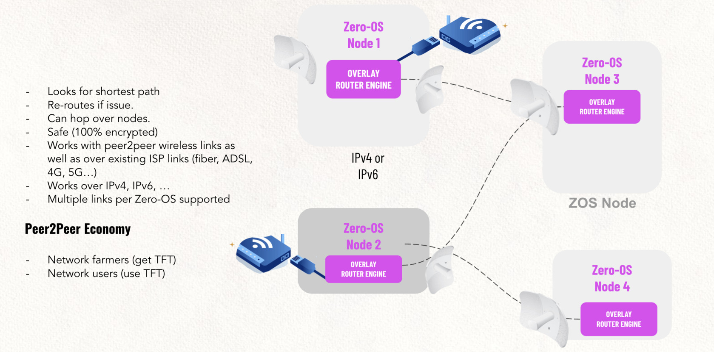

## Solution components

Here is a brief description of how our suggested meet the necessary conditions.

### NC1: Secure and autonomous Operating System

The principles to build a secure and autonomous operating system to build a decentralized and distributed grid of capacity are as follows:

- *Autonomy*: to create compute, storage and networking capacity everywhere you can not rely on a remote (or a local) maintainer of the operating system. Also owners should not have to be operating system administrators.  By making the OS autonomous and not allowing owners or systems administrators to log in to the OS you make it a very secure operating system.
- *Simplicity*: An operating system should be simple, able to exist anywhere, for anyone, good for the planet.  Simplicity also enhances the overall security of a system 
- *Stateless*: In a grid (Peer To Peer) set up, the sum of the components is providing a stable basis for single elements to fail and not bring the whole system down. Therefore, it is necessary for single elements to be stateless, and the state needs to be stored within the grid.  

Building an autonomous, simple and stateless OS is not an easy feat.  Not having access means that is has to be 100% right at time of deployment.  Zero-OS has been developed and improved over the last 5 years and is now ready to be the capacity generator for secure IT workloads where compute, storage and networking components interact.

Thanks to ThreeFold we have this solution available to use in our solution for Casperlabs.

### NC2: Immutable and always-append storage protocol

In such an autonomous operating system storing data needs to be done in a very secure manner.  

As owners, administrators and users do not have direct access to the operating system a very secure environment is created to run applications and store data.  Also since this operating system is made to form a grid creating ubiquitous compute, storage and network utility local storage devices can be used to make a "dispersed" storage system.

Thanks to ThreeFold we have this solution available to use in our solution for Casperlabs.

Our solution as base for the backend of our dispersed storage system is called zero-DB.

Zero-db is a fast and efficient key-value store (redis-protocol compatible), which makes data persistent inside an always append data file, with namespaces support.  This zero-DB is able to receive and send information over a secure network that spans between all the zero-OS's and as such many zero-DB's can together create a large storage lake.

The Zero-DB stores data like a key-value store, and can operate (when configured to do so) to store data sequentially which makes it an "always append" storage device.  For caching purposes it can also be configured to not do this.

### NC3: Encrypted secure networking: the Planetary Network

The planetary network is an overlay network which lives on top of the existing internet (or any other network created). In this network, everyone can direct connect to everyone and routing does not rely on ISP and Tier 1 providers routing tables. The technology uses a Distributed Hash Table that allows all participating nodes to find the best network path to where it needs to send data. End-to-end encryption between application on the zero-OS's.

Each user and network point is strongly authenticated and uniquely identified, independent of the network carrier used. There is no need for a centralized firewall or VPN solutions, as there is a circle based networking security in place.

Thanks to ThreeFold we have this solution available to use in our solution for Casperlabs.

Benefits :

- shortest possible paths between peers, independent of the network providers routing decisions
- end-to-end encrypted data transport create full security
- peer2peer links like meshed wireless
- broken internet links do not affect the operating of traffic by re-routing traffic when needed

### NC4: Filesystem that presents remote storage to blockchain node

Thanks to ThreeFold we have this solution available to use in our solution for Casperlabs.

Quantum Safe Storage System uses a dispersed storage algorithm to distribute the data in a smart way and store data in different locations. The original object is fragmented, compressed and encrypted, and than a "description" is created of that compressed and encrypted fragment which is stored. The original compressed and encrypted data is deleted.  Only that description of that data part  of the information is stored, making it impossible to understand what data(part) is stored on a single device as you need all the descriptions together to be able to "un-describe" the compressed and encrypted original data

The data is described in a way such that a person aiming to hack into the low-level data (which is almost impossible in itself), will only find non-relevant information on this storage infrastructure and the other data shards can’t be re-created, making it quantum-proof.

Quantum Safe Storage System offers the following storage benefits:

- Store Petabytes of data at hyper-competitive pricing.
- Quantum-safe security (not even a quantum computer can hack).
- A filesystem interface see Quantum Safe Filesystem
- Unlimited scalability provided by the ThreeFold P2P infrastructure.
- Self-healing capability of the storage layer ensures your data remains available at all times.

### NC5: Secure access to de-duplicated data

ThreeFold Tech has developed the technology to store immutable records in a more space efficient way, relying on a fully decentralized grid of storage capacity. No participant has the full storage volume on his hard drive, however the combination of all participants allows recomposing of the full ledger with all records. This method brings many benefits: 

- The storage happens in a very, quantum-resilient way, as attacking one chunk gives insufficient information to recreate the authentic data;
- Storage grows slower over time compared to a classic blockchain setup, as storage overhead can be limited to about 20% instead of the ‘traditional’ 10000% (in the case of 100 participants running a blockchain node) overhead;
- It allows for an easy way to implement pruning: only the current state is really required to be stored locally, and when transactions come in, a recalculation is made, and the storing of the historical transactions is directly done using QSFS

### NC6: Proof of Retrievability (POR)

We need to have a way for archived chain to have proof of retrievability (POR). A POR is a protocol in which a server/archive proves to a client that a target file F is intact, in the sense that the client can retrieve all of F from the server with high probability.

For a good working pruning solution POR is a necessary conditions

This needs to be created on top of ThreeFold Quantum Safe Storage System.