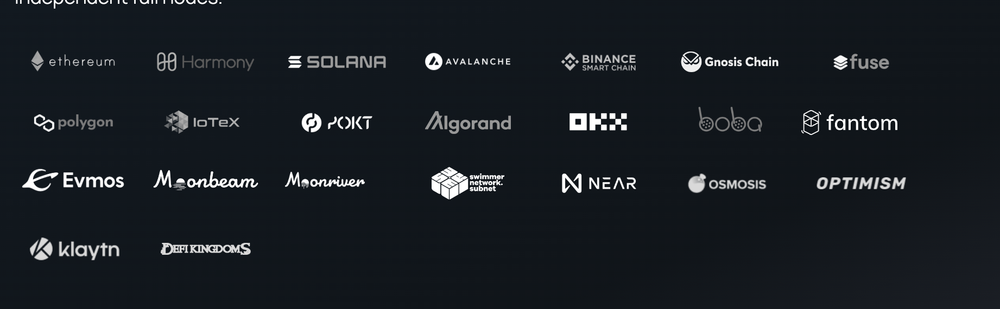
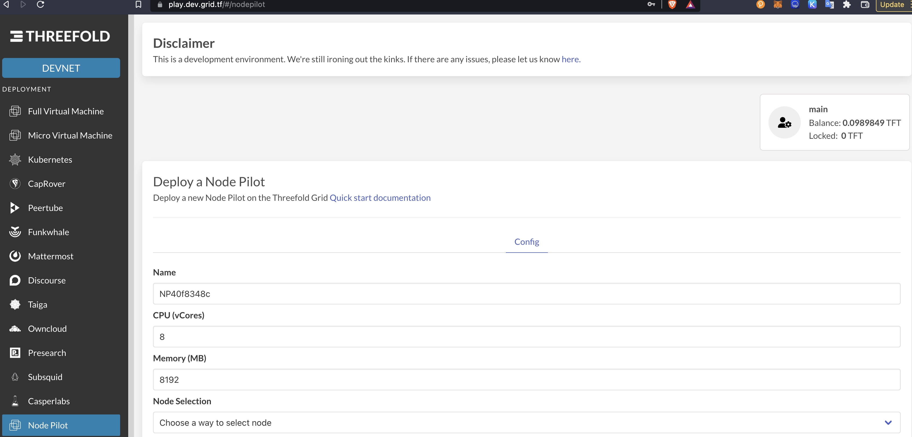
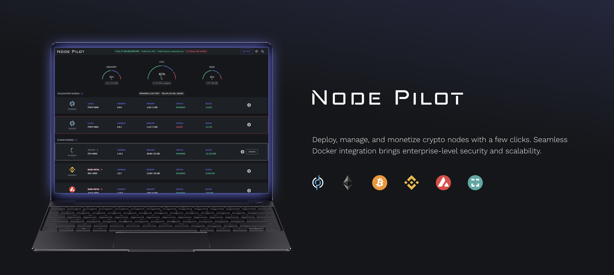

# Pokt.Network

Is a deployment solution for blockchains which demonstrates how thin provisioning works using ThreeFold Quantum Safe Storage FileSystem

  

As part of this research we have developed a deployment on Threefold grid to deploy pokt.

  

This was lots of work for our engineering team but now has now been integrated in our development branch ThreeFold Grid.

Its now possible for people to deploy Node Pilot on ThreeFold Grid.

## We have been able to demonstrate:

- **We can deploy a full deployer in < 30 minutes rather than days**

This is amazing news it demonstrates how quantum safe filesystem is a solution for deployment.

We still need to do some hardening to let this work on more blockchains.

We have been able to test this on all blockchains as port of Pokt.Network, we recomment everyone to play with this.

> to try yourself see: https://play.dev.grid.tf/

## Nodepilot

To make it easier for people to get started we used nodepilot

  