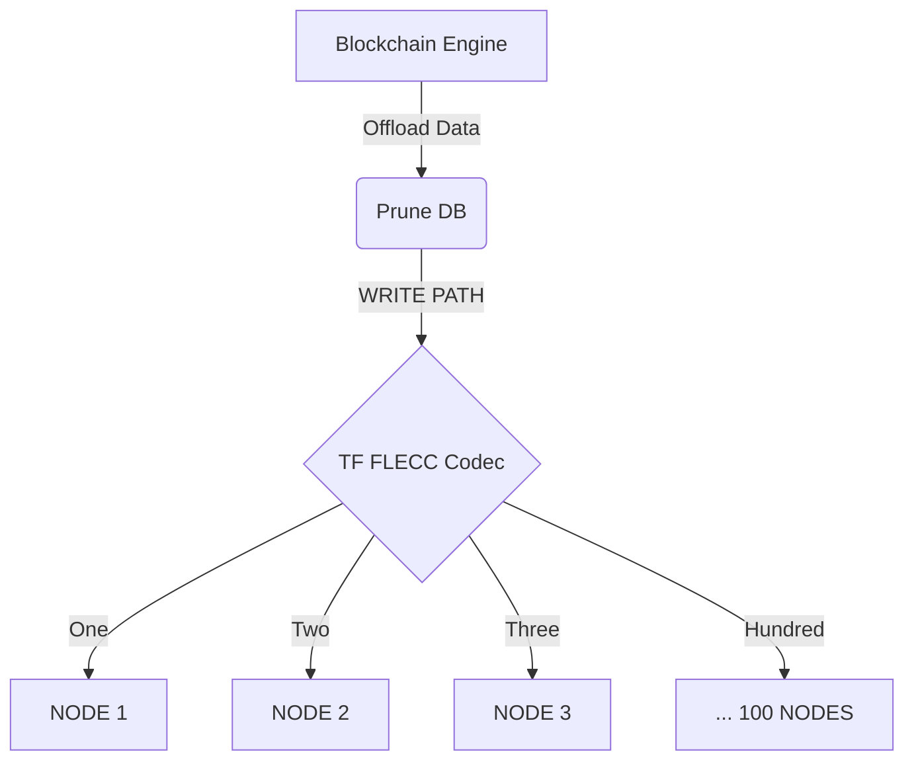
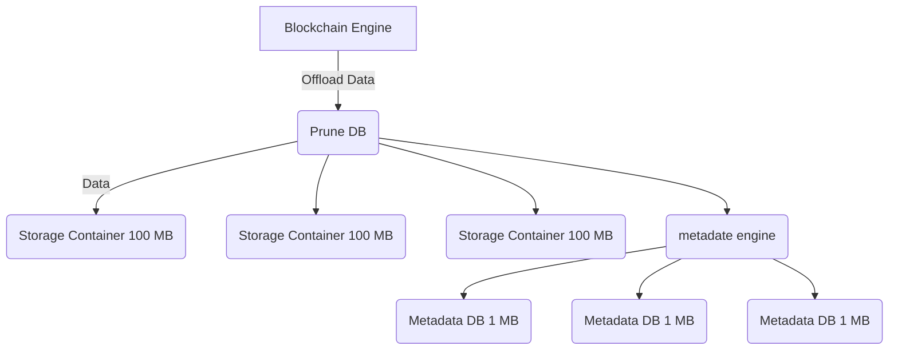
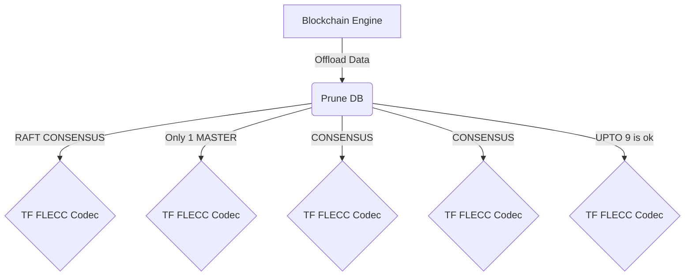
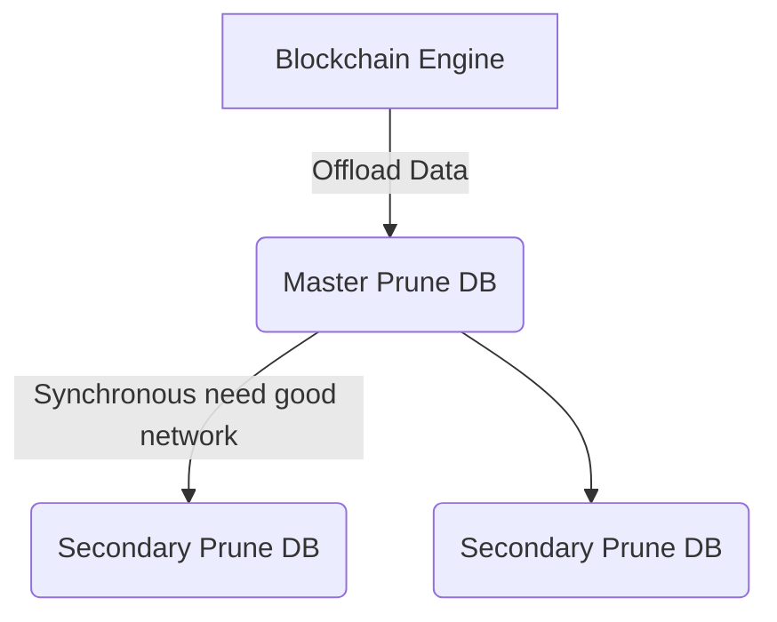
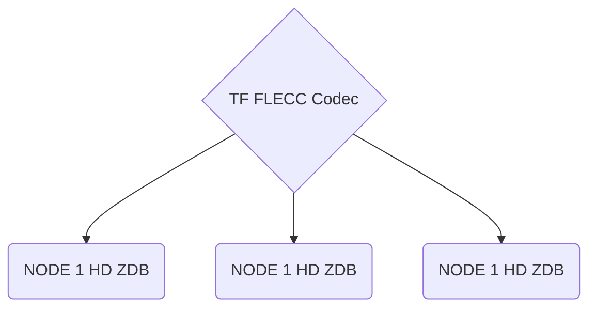
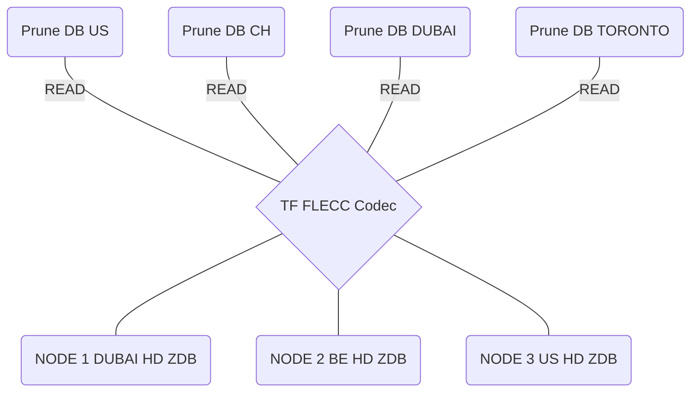

## Architecture (this grant)

For write path we write to e.g. 100 nodes, all over the world. This amount is configurable and also the storage policy used.

Default we could use like 20 + 80, means min 20 nodes are needed to re-create the original. This means upto 60 nodes can be lost before data is lost.

## The Prune DB

Is a fast key value stor which can be used as backend for the storage engine of the blockchain for pruning support.

This key value stor will write in local DB's (storage containers see further) which are configurable in size and can be possitioned on storage system of choice, we recommend SSD.

The storage containers are cacheable, once written they can be removed, if data is needed from a contaier it will be fetched back from the FLECC CODEC in a redundant way. This will make the Prune DB caching aware and can support petabytes easily.

Above provides for a very scalable system, the metadata DB's and DATA DB's get offloaded using the FLECC Codec towards potentially thousands of nodes on the backend.

## Self Healing (this grant)

The system should be full self healing, this means if nodes get offline, or there is data rot (corrupted data), the data needs to be corrected automatically and redistributed so that we get back to the original health of the data in line with original policy.

## Corruption Proof

Data should not be able to get corrupted, once corruption occurs because of network or storage subsystem the codec needs to be able to recover it right away.

## The write path is redundant

The Consensus layer for write ath will be based on Tendermint (or alternative if CasperLabs has suggestions).

The Pruning DB creates storage containers of 1-100 MB in size (configurable). Each Storage Container gets put in separate file if a configurable time interval got passed or a certain size for the storage container, default 100 MB.

##  Redundancy for Prune DB

We will not make the Pruning DB active-active but this can be done as part of the next grant. For now the pruning DB will write the storage containers with data and metadata. If the node on which we do the activiation of the pruning dies then that pruning action will have to be restarted.

Active-Passive clustering can be build inside the Pruding DB.

Only one pruning DB is active, if the master is down, a Raft mechanism might be used (next grant) to define which DB becomes the new master.

## Each Zeros-Node can store 500 TB.

100+ ZDB's can be used by 1 codec, the codec will make sure that data is spread out good enough.

## Read Path

The read path is different and redundant by design. Thanks to the FLECC Codec we can read data from hundred of sources and this can happen by many readers at the same time.

This leads to the fastest possible way how to retrieve data so the prune DB can retrieve the data it needs.

Once a storage container is retrieved it will stay in cache untill no longer needed.

The caching layer needs to be intelligent to delete the right files as much as possible.

## Read Optimization (Grant Future)

We can implement a system which will allow a faster retrievel, in the suggested system we only need to retrieve 20 files from the 100 ZDB's (backend DB's), what if the system would be smart enough to figure out which files to retrieve first and depending who answers fastest the data can be rebuild to have back the original data. It could work with e.g 50 of the 100, the first 20 who deliver allow the data to be retrieved, this would dramaically speed up retrieval and data would come from latency locations close by.